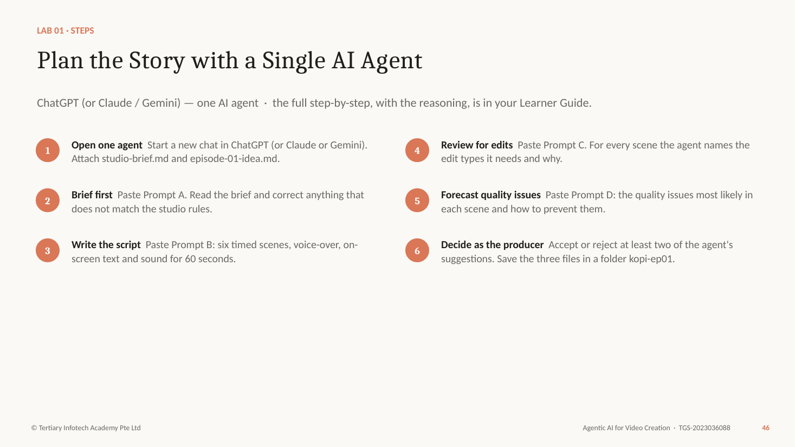
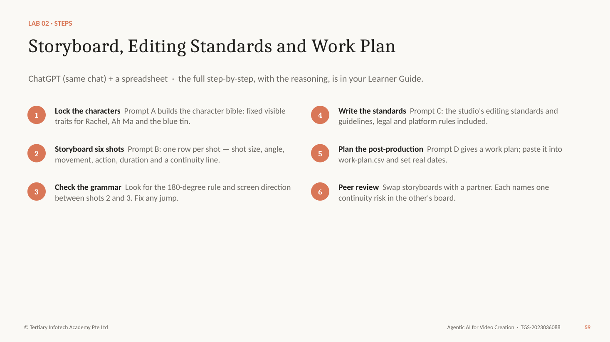
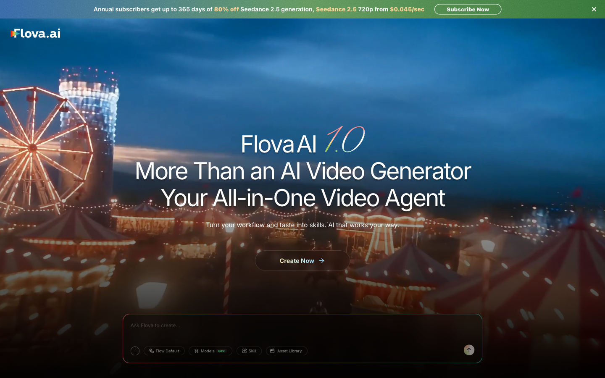
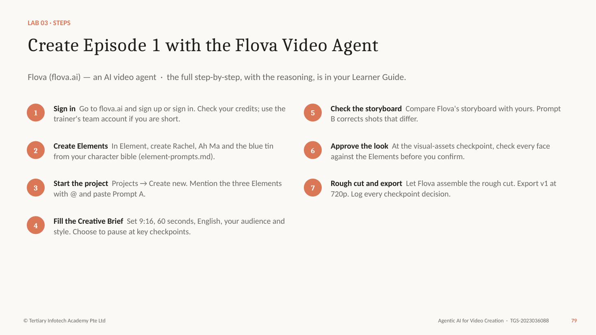
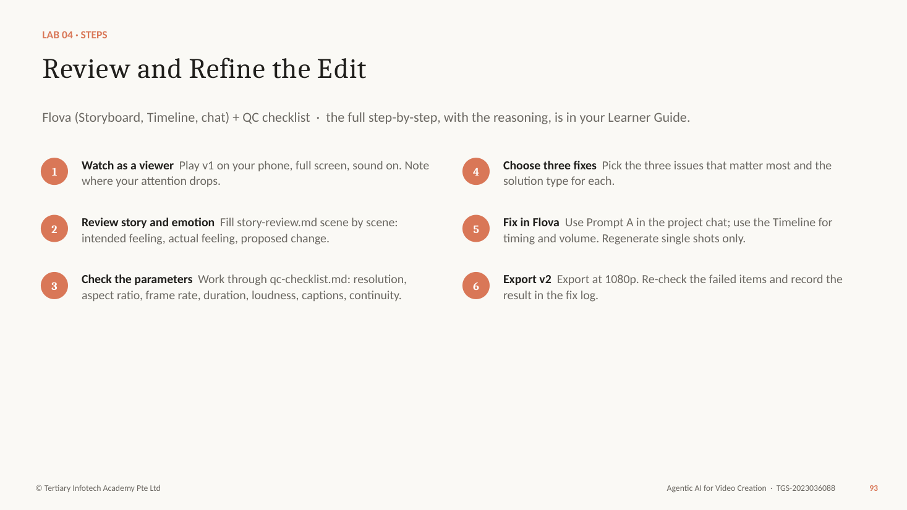
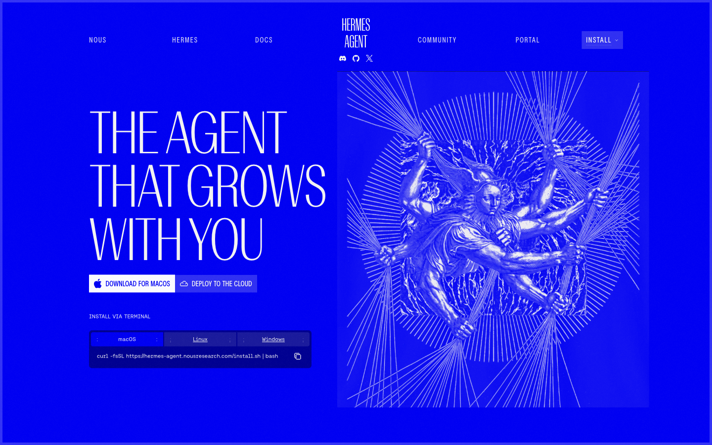
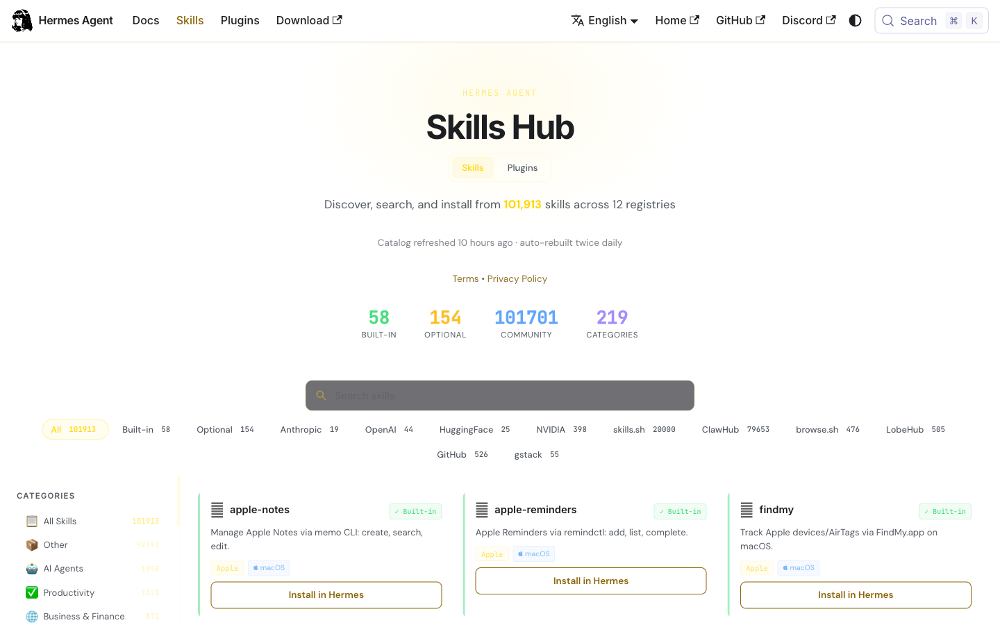
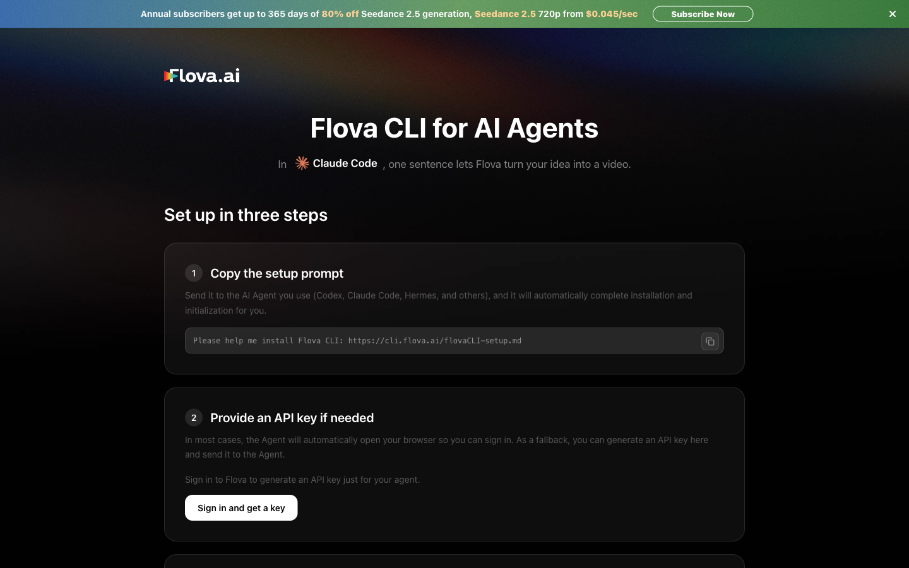
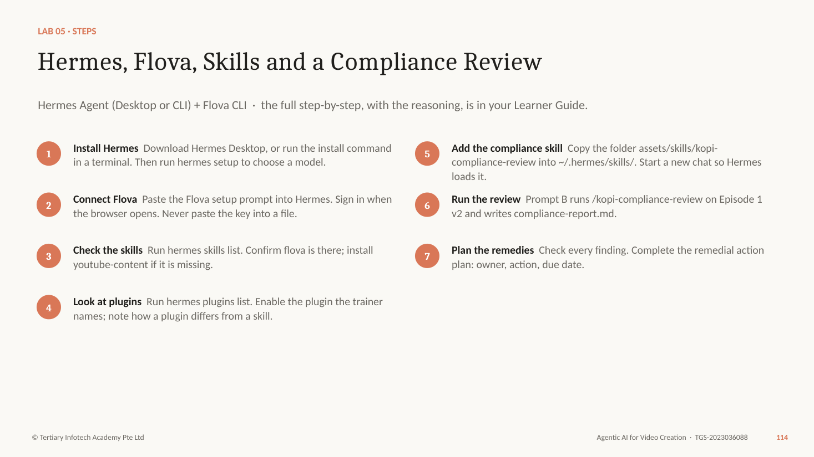
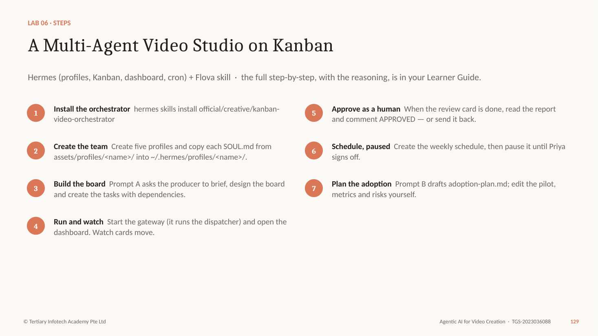

# Agentic AI for Video Creation — Learner Guide

TGS-2023036088 · Version 5.0 · Tertiary Infotech Academy Pte Ltd (UEN 201200696W)

## How to Use This Guide

This guide explains every idea in the course and carries the full step-by-step for every lab, with the reasoning behind each step. The slides introduce the idea; this guide is what you follow at the keyboard and use as your open-book reference in the assessment. Every lab also has its own folder in the lab pack with a README, the prompts as Markdown and PDF, templates, sample outputs and a checklist.

Before you start, have ready:

- A laptop with internet access and a modern browser, and your phone to watch vertical video.
- A chat AI assistant — ChatGPT, Claude or Gemini (free tier is enough) — for Labs 1-2.
- A Flova account (flova.ai) for Labs 3-6. New accounts receive sign-up credits; the trainer has a team account if you run short.
- For Labs 5-6: permission to install software (Hermes Agent and the Flova CLI) and a model provider for Hermes.
- The lab pack, unzipped. Keep one working folder, kopi-ep01, for your files.

Prompts appear as shaded quotes — paste them as written, then adapt. Commands appear in grey monospace blocks. Product menus change between releases: if a name here differs from your screen, follow the screen and tell the trainer. Never paste an API key into a prompt, a file you share or a screenshot.

## The Scenario: Kopi & Coins

Kopi & Coins is a small Singapore content studio that makes 60-second money stories for young working adults on YouTube Shorts, TikTok and Instagram Reels. Its founder, Priya Nair, has hired you as the studio's AI video producer.

Every episode follows one family: Rachel Tan, 29, a marketing executive who is good at her job and not yet good with money; her grandmother Ah Ma, 74, who kept the family's savings in a blue butter-cookie tin; and Rachel's colleague Daniel Lim, 30, who spends every bonus before it lands.

Episode 1, The Rainy-Day Tin, teaches the emergency fund. Episode 2, Daniel's Bonus, teaches "pay yourself first". The studio has one rule it never breaks: general money education only — no product recommendations, no promised returns, and a clear disclaimer on every video.

Over two days you take the series from an idea to a repeatable studio:

- Plan — one AI agent writes and reviews the script (Labs 1-2)
- Make — a video agent, Flova, produces and fixes it (Labs 3-4)
- Scale — a Hermes multi-agent team runs the pipeline (Labs 5-6)

## About This Course

**Course:** Agentic AI for Video Creation (TGS-2023036088) · **TSC:** Video Editing-4 (MED-MPN-4005-1.1) · 2 days, 16 hours including a 2-hour assessment.

### Learning Outcomes

- **LO1:** Develop editing strategies and work plans to achieve creative vision.
- **LO2:** Assess edited footage to enhance storytelling and ensure technical compliance.
- **LO3:** Develop remedial actions to ensure industry compliance and facilitate the adoption of new technologies in visual editing.

### Knowledge and Abilities

| Code | Statement | Where you learn it |
|---|---|---|
| K1 | Types of quality issues in video content | T1 · Quality issues in video content · Lab 1 |
| K2 | Types of solutions to rectify quality issues | T2 · Quality issue → solution · Labs 3-4 |
| K3 | Parameters to assess video quality | T2 · Parameters to assess video quality · Lab 4 |
| K4 | Industry quality standards | T3 · Industry quality standards · Lab 5 |
| K5 | Technologies that improve efficiency and quality of video edits | T3 · Emerging video technologies · Labs 5-6 |
| A1 | Review scripts to conceptualize the types of edits required to achieve creative vision of production | T1 · Reviewing a script for edits · Lab 1 |
| A2 | Develop editing standards and guidelines in accordance to legal requirements and broadcasting standards | T1 · Editing standards and guidelines · Lab 2 |
| A3 | Develop work plans to outline the processes and timelines needed for the post production processes | T1 · Post-production work plans · Lab 2 |
| A4 | Review edited footage to propose changes that will enhance the story and emotions in each scene | T2 · Story and emotion review · Lab 4 |
| A5 | Assess edited footage against technical parameters to ensure alignment to requirements | T2 · Technical QC against parameters · Lab 4 |
| A6 | Develop remedial actions to resolve issues that do not comply with industry standards | T3 · Remedial action plans · Lab 5 |
| A7 | Facilitate the adoption of new technologies to improve the efficiency and quality of visual outputs | T3 · Adoption roadmap · Lab 6 |

## Topic 1 — Creative Strategy and End-to-End Video Production with Agentic AI

Slides 20–65 · LU1 · **LO1:** Develop editing strategies and work plans to achieve creative vision.

**Knowledge:** K1 — Types of quality issues in video content

**Abilities:** A1 — Review scripts to conceptualize the types of edits required to achieve creative vision of production; A2 — Develop editing standards and guidelines in accordance to legal requirements and broadcasting standards; A3 — Develop work plans to outline the processes and timelines needed for the post production processes

In this topic you will learn:

- A short history of AI, and agentic AI vs AI agents
- One AI agent: the loop, tools, skills and memory
- Principles of video creation: story, script, storyboard, characters, shots
- Quality issues, script review, standards and work plans

### Key ideas for Lab 1

#### A Short History of AI (1950–2017)

Artificial intelligence began as a question — can machines think? — and moved from hand-written rules, to search, to systems that learn from data. Two breakthroughs made today's tools possible: deep learning (2012), which let neural networks learn from millions of examples, and the Transformer (2017), the architecture behind every large language model.

- **1950 · The Turing test** — Alan Turing asks "Can machines think?" and proposes the imitation game.
- **1956 · "Artificial intelligence"** — The Dartmouth workshop names the field. Rules and logic dominate for decades.
- **1997 · Deep Blue** — IBM's chess computer beats world champion Garry Kasparov — search, not learning.
- **2012 · Deep learning** — AlexNet wins ImageNet. Neural networks learn from data and GPUs make them fast.
- **2017 · The Transformer** — "Attention Is All You Need" — the architecture behind every modern language model.

Each era changed what a computer could do on its own: follow rules, search, learn, then understand language.

#### From Chatbots to Video Agents (2022–2026)

ChatGPT made generative AI an everyday tool in 2022. Models then learned to see and make images and video. From 2025 models began to plan, use tools and check their own work — agentic AI. By 2026 always-on AI agents such as Hermes, and video agents such as Flova, can run whole creative workflows under human direction.

- **2022 · ChatGPT** — Generative AI goes mainstream: ask in plain English, get an answer.
- **2023 · Multimodal AI** — Models read and make images; text-to-video tools produce the first short clips.
- **2024 · Video models** — Realistic text-to-video previews; minutes of consistent motion become possible.
- **2025 · Agentic AI** — Models plan, call tools and check their own work — coding agents lead the way.
- **2026 · AI agents** — Always-on agents (Hermes, OpenClaw) and video agents (Flova) run whole workflows.

Years show when each practice took hold. For video, the shift is from a tool you operate to an agent you direct.

#### How AI Changed Video Production

The same job — a 60-second video — done four ways.

| Stage | Who does the work | What you control |
|---|---|---|
| Editing software | You shoot, cut, colour and caption every frame by hand. | Everything — and you do everything. |
| Generative clips | A model makes a 5-10 second clip from a prompt; you assemble the rest. | One prompt per clip; consistency is hard. |
| Video agent | One agent writes, storyboards, generates and edits in a single project. | The brief and the checkpoints — you direct. |
| Multi-agent studio | A team of agents researches, writes, makes, reviews and schedules. | The roles, the gates and the final approval. |

Tip: This course walks the last three rows: one agent (T1), a video agent (T2), a multi-agent studio (T3).

#### Agentic AI vs AI Agents

The two terms are often used loosely. In this course: both use tool calling and skills, and both use memory. Agentic AI is task-oriented — it is given a task, works through it and stops, so it need not run 24/7. An AI agent is always on: it lives on a computer or server, keeps long-term memory and can be woken by a schedule, a message or another agent.

Both use the same building blocks. The difference is how long they live and what starts them.

**Agentic AI — task-oriented**

- Uses tool calling and skills to complete a task.
- Uses memory within the task (and often across sessions).
- Starts when you give it a task; stops when the task is done.
- Need not be on 24/7. Example: Flova making Episode 1 for you.

**AI agents — always on**

- Also use tool calling and skills.
- Also use memory — long-term, about you and your work.
- Run 24/7 on a computer or server; wake on schedules and messages.
- Example: Hermes Agent running the studio's weekly pipeline.

#### Side by Side

Use this table to decide what you need for a video job.

| Feature | Agentic AI | AI agents |
|---|---|---|
| Tool calling | Yes — generates images, video, voice, music. | Yes — plus files, browser, terminal, other apps. |
| Skills | Yes — reusable workflows (Flova Skills). | Yes — SKILL.md folders it can create and improve. |
| Memory | Yes — project history, references, elements. | Yes — long-term memory across every session. |
| Availability | Task-oriented; may not be on 24/7. | Always on, 24/7; reachable by chat apps. |
| Started by | You, with a task. | You, a schedule (cron), a message or another agent. |
| In this course | Topic 2 — the Flova video agent. | Topic 3 — Hermes Agent and its team. |

#### Anatomy of a Single AI Agent

A language model on its own can only answer. An agent wraps the model with instructions, tools, skills, memory, context and guardrails so it can take actions and check them. Start every project with one agent; add more only when the work clearly splits into different jobs.

Start with one agent. A model on its own only answers; the parts around it let it act.

**The model** (the brain): Reads the goal, plans the next step and decides which part to use.

- **Instructions** — Who the agent is and the rules it follows — the studio brief, SOUL.md.
- **Tools** — Actions it can take: generate an image, render video, search, read a file.
- **Skills** — Saved procedures it loads when the task matches — "review a script for edits".
- **Memory** — What it keeps: your preferences, past episodes, the character bible.
- **Context** — What it can see right now: attached files, the chat, the project state.
- **Guardrails** — Approvals, permissions and limits — what it must ask before doing.

One agent is enough when the work is one line of thought. Add agents only when the work splits into different jobs.

#### The Agentic Loop

The loop is goal, plan, act, observe, reflect — repeated until the goal is met or the agent needs approval. Your job is to give a clear goal and rules, and to review at the points where a mistake is expensive.

Every agent — chat, video or multi-agent — runs the same loop until the goal is met.

1. **Goal** — You state the outcome: "a 60-second episode on emergency funds".
1. **Plan** — The agent breaks it into steps: brief, script, storyboard, shots.
1. **Act** — It calls a tool or skill: write, generate, edit.
1. **Observe** — It reads the result: a script, a frame, a cut.
1. **Reflect** — It checks against the goal and your rules, then loops or stops for approval.

Tip: Give the goal and the rules, not micro-steps. Review at the points where a mistake is expensive.

#### Tools, Skills and Memory in a Video Agent

The three things that turn a chatbot into a production assistant.

- **Tools — what it can do** — Image models for characters and scenes, video models for motion, voice and music generation, captioning, the timeline editor, export.
- **Skills — how you want it done** — A saved workflow: "Kopi & Coins episode: 9:16, 60 s, warm light, captions on, disclaimer end card".
- **Memory — what it remembers** — The character bible, the brand, the last episode's fixes, your feedback style. Next episode starts ahead.

#### Which Agent for Which Job

Match the agent to the work. Bigger is not better.

| Agent | Best for | In this course |
|---|---|---|
| A chat AI agent | Thinking work: briefs, scripts, reviews, standards, plans. | Labs 1-2 (ChatGPT, Claude or Gemini) |
| A video agent | Making the video: storyboard, generation, voice, music, timeline, export. | Labs 3-4 (Flova) |
| An always-on agent | Running a repeatable pipeline, connecting tools, checking compliance. | Lab 5 (Hermes + Flova) |
| A multi-agent team | Work with distinct roles, reviews and a human approval gate. | Lab 6 (Hermes profiles + Kanban) |

Tip: Rule of thumb: one line of thought → one agent; several jobs with hand-offs → a team.

#### The Video Production Lifecycle

AI does not remove the classic stages of production; it changes who does them and how fast. Skipping pre-production is the most common reason AI video looks random — there is no brief, no storyboard and no character reference for the model to follow.

AI changes who does each stage — not the stages themselves.

1. **Development** — Idea, audience, message, creative brief.
1. **Pre-production** — Script, storyboard, characters, references, standards, plan.
1. **Production** — Shoot — or generate — the shots, voice and music.
1. **Post-production** — Assemble, edit, sound, captions, colour, QC.
1. **Distribution** — Compliance check, approval, export, publish, measure.

Tip: Most AI-video failures are pre-production failures: no brief, no storyboard, no character references.

#### Creative Vision

Four decisions to make before anyone writes a line.

- **Logline** — The story in one sentence. "A young professional learns from her grandmother's biscuit tin why every payday starts with a rainy-day fund."
- **Audience** — Who exactly, on which platform, watching how. Young working adults, on a phone, sound often off.
- **One message** — What the viewer should remember. Pay your rainy-day fund first.
- **Tone and look** — Warm, hopeful, slice-of-life; soft natural light; a Singapore HDB home.

#### Story Structure for 60 Seconds

Short-form video compresses the three-act structure into about six beats. The hook must make the viewer feel the problem within five seconds; the payoff should mirror the hook so the change is obvious.

Short-form still needs a beginning, middle and end — compressed.

1. **Hook  0-5 s** — A problem the viewer feels at once: the laptop dies, the bank balance is $312.
1. **Set-up  5-15 s** — Who and where: Rachel calls Ah Ma.
1. **Turn  15-30 s** — The surprise: the tin is full of labelled envelopes.
1. **Choice  30-45 s** — The character acts: three savings buckets on payday.
1. **Payoff  45-55 s** — Six months later, the next shock is calm.
1. **End card  55-60 s** — The call to action and the disclaimer.

#### Writing a Short-Form Script

A script for the eye and the thumb, not the page.

- **Hook in 3 seconds** — Open on the problem, not the logo. If the first frame does not ask a question, viewers swipe.
- **Show, then tell** — Let the picture carry the story; voice-over adds only what the picture cannot.
- **Short lines** — About 2.5 spoken words a second — under 140 words for 60 seconds.
- **On-screen text** — The rule the viewer must remember appears as text: "Rule 1: rainy day first."
- **Sound cues** — Mark music changes and effects in the script; they carry emotion.
- **One call to action** — End with one thing to do, plus the disclaimer.

#### The Storyboard

A storyboard breaks the script into shots. Each shot has one size, one angle, one movement and one action, plus a continuity line that says what must stay the same. This is also the right unit for an AI video model: one prompt per shot.

A storyboard turns the script into shots — the units an AI model actually generates.

- **One shot, one action** — Each frame shows a single action. Two actions in one prompt is where AI video falls apart.
- **Shot details** — Size, angle, movement, duration, characters, sound and on-screen text for every shot.
- **Continuity line** — What must stay the same as the previous shot: clothes, props, light, direction.
- **Cheap to change** — Moving a sketch costs nothing; regenerating a shot costs credits and time.

#### Shot Sizes

Choose the size by what the viewer needs to see — and feel.

| Shot | What it shows | Use it for |
|---|---|---|
| ECU — extreme close-up | An eye, a hand, a phone screen. | Detail and tension: the $1,400 repair quote. |
| CU — close-up | A face fills the frame. | Emotion: Rachel's reaction. |
| MCU — medium close-up | Head and shoulders. | Dialogue and video calls. |
| MS — medium shot | Waist up, some setting. | Action with context: setting up the savings buckets. |
| WS — wide shot | The whole person and the room. | Place and time: six months later. |
| EWS — extreme wide | A building, a city skyline. | Establishing shots and transitions. |

#### Camera Angles and Movement

Name them in every shot prompt — AI models follow camera language.

| Term | What it does | Example in Episode 1 |
|---|---|---|
| Eye level | Neutral; the viewer is an equal. | Most dialogue. |
| High / low angle | Makes a subject smaller / stronger. | Low angle on Ah Ma holding the tin. |
| Over-the-shoulder | Puts us in the conversation. | Rachel's phone screen during the call. |
| Static | Calm, observational. | The end card. |
| Push-in (dolly in) | Builds focus or tension. | Slowly onto the dead laptop. |
| Pan / tracking | Follows action or reveals space. | Following Rachel to the window. |

#### Characters and Consistency

Consistency comes from repeating concrete traits, not names. A character bible lists five visible traits that never change; reference images (Elements in Flova) let the model reproduce them in every shot.

Viewers forgive a cheap set; they do not forgive a face that changes.

- **Character bible** — Identity, age, role in the story, how they move and speak — written once, reused for every episode.
- **Five fixed traits** — Face, hair, glasses, clothes, colours. Repeat them in every shot prompt.
- **Reference images** — A front-view reference sheet per character. In Flova these become Elements.
- **Props are characters too** — The blue tin needs the same colour, dent and labels every time.

#### Composition for 9:16

Vertical video has its own rules — and the platform's buttons sit on top of your frame.

- **Rule of thirds** — Eyes on the upper third line; the subject on a third, not dead centre.
- **Safe zones** — Keep text out of the bottom ~20% and the right edge, where captions, likes and the caption bar sit.
- **Eyeline and 180-degree rule** — In a two-person scene, keep both on their side of an imaginary line so they face each other.
- **Screen direction** — If Rachel walks left to right in one shot, she keeps going left to right in the next.

#### Sound and Captions

Half the emotion is in the sound; most viewers start with it off.

- **Voice-over and dialogue** — Clear, close, never buried under music.
- **Music** — Sets the feeling; ducks under the voice; must be licensed or generated with rights.
- **Sound effects** — The laptop click, the tin lid — small sounds sell the moment.
- **Captions** — Always on for short-form; accurate, in sync, two lines at most, inside the safe zone.

#### Types of Quality Issues in Video Content

Quality issues fall into five types: technical picture problems, technical sound problems, issues typical of AI generation, story and continuity problems, and compliance problems. Knowing the type tells you how to spot the issue and which kind of solution will fix it.

Know what can go wrong so you can design it out — and spot it in review.

| Type | Examples | How you notice |
|---|---|---|
| Technical — picture | Low resolution, blur, flicker, compression blocks, wrong aspect ratio, black frames. | Full-screen playback on the target device; check export settings. |
| Technical — sound | Clipping, noise, music over voice, uneven loudness, out-of-sync audio. | Headphones; a loudness meter. |
| AI generation | Face drift, extra fingers, warped objects, garbled text, impossible physics, uncanny lip-sync. | Frame-by-frame checks against references. |
| Story and continuity | Weak hook, unclear message, slow pacing, props or clothes that change, jump cuts. | Watch as a viewer; compare adjacent shots. |
| Compliance | Unlicensed music, missing disclaimer, misleading claims, personal data, unlabelled AI content. | Check against standards and a checklist. |

#### Quality Issues Typical of AI Video

Generative video fails in recognisable ways. Name them so you can prompt against them.

- **Identity drift** — The face, hair or glasses change between shots.
- **Anatomy and objects** — Extra fingers, melting hands, a phone that bends.
- **Garbled text** — Signs, screens and labels become nonsense letters.
- **Physics and motion** — Objects pass through each other; walking slides; flicker between frames.
- **Lip-sync and voice** — Mouths out of time; voice that does not fit the character.
- **Style drift** — Lighting, colour or art style changes mid-episode.

#### Edit Types and When to Use Them

Reviewing a script means deciding, scene by scene, which edits will create the intended feeling. A match cut links two ideas, a montage compresses time, a J-cut or L-cut lets sound lead or trail the picture, and a text overlay fixes the key idea in the viewer's memory.

Reviewing a script means deciding which edits will deliver the creative vision.

| Edit | What it does | Episode 1 example |
|---|---|---|
| Cut / jump cut | Moves on instantly; a jump cut compresses time. | Laptop dies → bank balance. |
| Cutaway / B-roll | Shows detail that supports the voice. | The labelled envelopes inside the tin. |
| Match cut | Links two shots by shape or action. | The tin lid closing → the banking app opening. |
| Montage | Compresses time in a rhythm of short shots. | Three paydays in three seconds. |
| J-cut / L-cut | Sound leads or trails the picture. | Ah Ma's voice starts before we see her. |
| Text overlay | Puts the key idea on screen. | "Rule 1: rainy day first." |

#### Reviewing a Script for Edits

A procedure you can run on any script — with or without an agent.

1. **Find the vision** — Re-read the brief: audience, one message, tone.
1. **Mark the beats** — Split the script into hook, set-up, turn, choice, payoff, end card.
1. **Name the feeling** — For each beat, what should the viewer feel?
1. **Choose the edits** — Pick the edit types that create that feeling (cut, match cut, montage, J/L-cut, text).
1. **Flag the risks** — Note the quality issues each scene invites.
1. **Decide** — Accept, change or reject — and record why.

Tip: The agent can draft the review; the producer owns the decisions.

### Lab 1 — Plan the Story with a Single AI Agent

**The story so far:** Priya wants Episode 1, The Rainy-Day Tin, live in two weeks. Before anyone spends a credit on video, the story has to work on paper — and you need to know which edits and which quality risks each scene will bring.

**Goal:** Use one AI agent to turn an idea into a brief and a timed script, then review the script to decide the edits each scene needs.

**You'll produce:** creative-brief.md, script-v1.md and script-review.md for Episode 1

**Agent:** ChatGPT (or Claude / Gemini) — one AI agent  ·  **Time:** 50 min  ·  **K & A:** K1, A1  ·  **Slides:** 45–51

**Lab folder:** labs/lab-01-plan-the-story-with-one-agent/ — assets/studio-brief.md, assets/episode-01-idea.md, assets/script-review-template.md, assets/sample/script-v1.md, assets/sample/script-review.md



Figure — Lab 1 workflow (slide 46)

**Why each step matters**

- One agent is enough here. Planning is a single line of thought — brief, script, review — and a second agent would only repeat it. You will add agents in Topic 3, when the work splits into different jobs.
- Attach the two files rather than pasting them, so the agent can re-read them at every step. That is the agent's context.
- The brief comes before the script because it fixes the audience, the one message and the rules. A script written without a brief drifts into generic money tips.
- The script review is the A1 skill: reading a script and deciding which edits will deliver the creative vision — a match cut between the tin and the banking app, a montage for "six months later", a text overlay for the rule.
- Your decision step matters. The agent proposes; the producer decides. Record why you rejected a suggestion — that note is evidence of judgement.

**Step-by-step**

1. **Open one agent** — Start a new chat in ChatGPT (or Claude or Gemini). Attach studio-brief.md and episode-01-idea.md.
1. **Brief first** — Paste Prompt A. Read the brief and correct anything that does not match the studio rules.
1. **Write the script** — Paste Prompt B: six timed scenes, voice-over, on-screen text and sound for 60 seconds.
1. **Review for edits** — Paste Prompt C. For every scene the agent names the edit types it needs and why.
1. **Forecast quality issues** — Paste Prompt D: the quality issues most likely in each scene and how to prevent them.
1. **Decide as the producer** — Accept or reject at least two of the agent's suggestions. Save the three files in a folder kopi-ep01.

**PROMPT A — creative brief**

> You are a video producer for Kopi & Coins. Read the two attached files.

> Write a one-page creative brief for Episode 1, "The Rainy-Day Tin", as Markdown with these headings: audience, the one message, platform and format (9:16, 60 seconds), tone, story logline, characters, call to action, must include, must avoid.

> Rules: general money education only. No product names, no promised returns, no numbers we cannot source. Ask me up to three questions before you write if anything is unclear.

**PROMPT B — the 60-second script**

> Using the approved brief, write the script for Episode 1.

> Six scenes, timed to exactly 60 seconds:
> hook (0-5s), set-up, turn, choice, payoff, end card (55-60s).

> For each scene give: time range, what we SEE, voice-over or dialogue, on-screen text, and sound (music cue or effect). Keep spoken lines short — under 140 words in total. End card: "Start your rainy-day tin this payday." plus the disclaimer from the studio brief.

**PROMPT C — script review for edits**

> Review script-v1 as a video editor before production.

> Make a table, one row per scene: scene, what the scene must make the viewer feel, the edit types it needs (for example cut, cutaway or B-roll, match cut, montage, J or L cut, text overlay, speed ramp, transition, music cue), and why each edit serves the story.

> Then list two scenes where a different edit would be stronger, and say what you would change.

**PROMPT D — quality-issue forecast**

> For the same six scenes, forecast the quality issues we are most likely to meet when an AI video agent makes this episode.

> Group them as: technical (picture and sound), AI generation (for example face drift, extra fingers, garbled text), story and continuity, and compliance (music rights, disclaimer, misleading money claims).

> For each issue give the scene, how we would notice it, and one way to prevent it in the prompt or the edit.

**Check your work**

- ☐  The brief names one audience, one message and the must-avoid rules.
- ☐  The script has six scenes that add up to exactly 60 seconds.
- ☐  The end card carries the call to action and the disclaimer.
- ☐  script-review.md lists the edit types for every scene, with a reason for each.
- ☐  The quality forecast covers all four groups of issues.
- ☐  You accepted or rejected at least two suggestions and wrote why.

**If it goes wrong**

- **The agent invents statistics** — Reply: "Remove every number you cannot source. Use general wording instead."
- **The script runs long** — Ask for a word count per scene and a 140-word cap; spoken English runs about 2.5 words a second.

**Stretch**

- Ask the agent for a 30-second cut-down of the same script and compare which scenes survive.

Why it matters: The cheapest place to fix a video is the script. Every edit you decide now is a regeneration you will not pay for later.

### Key ideas for Lab 2

#### Editing Standards and Guidelines

Editing standards are the written rules every episode must meet. Writing them down makes them checkable by a reviewer — and usable by an AI agent as a skill. Each rule should have a number or a yes/no test.

The written rules every episode — and every agent — must meet before publishing.

- **Brand** — Colours, fonts, logo position, the end card.
- **Story** — Hook in 3 seconds, one message, pacing limits.
- **Captions** — Always on, accurate, two lines max, in the safe zone.
- **Audio** — Voice clarity, music under voice, loudness target.
- **Legal** — Rights, personal data, money messaging, AI labelling.
- **Platform** — 9:16, 1080x1920, frame rate, duration limits.

#### Legal Requirements for Video in Singapore

A studio publishing money education in Singapore must respect copyright, personal data protection, the line between general education and regulated financial advice, advertising standards, and platform rules on AI-generated content. This table is general guidance for the course scenario, not legal advice.

What the studio's guidelines must protect against. General guidance — not legal advice.

| Area | Requirement | Guideline for Kopi & Coins |
|---|---|---|
| Copyright | Copyright Act 2021: music, images and footage need permission or a licence. | Use licensed or rights-cleared generated music; record the licence. |
| Personal data | PDPA: do not collect, use or show personal data without consent. | Fictional characters only; no real bank screens or names. |
| Money messaging | Financial Advisers Act: recommending specific products is regulated advice. | General education only; no products, no promised returns; disclaimer. |
| Advertising | Singapore Code of Advertising Practice (ASAS): truthful, not misleading; disclose sponsorship. | No exaggerated claims; label any sponsored episode. |
| AI content | Platforms require labels for realistic altered or synthetic content. | Turn on the AI-content disclosure when uploading. |

#### Broadcasting and Platform Standards

Broadcast loudness is set by EBU R128 (-23 LUFS) in Europe and ATSC A/85 (-24 LKFS) in the US; streaming platforms normalise playback to roughly -14 LUFS. Picture, captions and framing have their own standards. Quote them with numbers in your guidelines.

Technical rules your guidelines should quote with numbers.

| Standard | Requirement | For a 60 s Short |
|---|---|---|
| Loudness — broadcast | EBU R128: -23 LUFS integrated, true peak ≤ -1 dBTP. | Reference for TV versions. |
| Loudness — streaming | Platforms normalise near -14 LUFS. | Mix to about -14 LUFS, true peak ≤ -1 dBTP. |
| Picture | Rec. 709 colour, constant frame rate, no black or frozen frames. | 1080x1920, 24-30 fps, H.264 MP4. |
| Captions | WCAG 2.2 — captions for all prerecorded audio. | Burned-in or uploaded; checked for accuracy. |
| Framing | Title- and action-safe areas. | Text clear of the bottom ~20% and the right edge. |

Tip: Platform limits change. Check the platform's help pages before each campaign.

#### The Post-Production Workflow

Post-production in order. Every stage has an input, an output and an owner.

1. **References** — Elements, style frames, voice — locked before generation.
1. **Assembly** — Shots placed in story order: the rough cut.
1. **Fine cut** — Timing, pacing and story review; picture lock.
1. **Sound and captions** — Voice, music, effects, loudness, captions.
1. **QC and compliance** — Technical parameters and standards checked.
1. **Approve and deliver** — Human approval, export, publish.

#### A Post-Production Work Plan

A work plan lists each post-production stage with its owner, duration, dependency and review gate. The dependencies define the critical path; the gates define where work stops until someone approves.

The plan your Lab 2 CSV follows — 10 working days for Episode 1.

| Stage | Owner | Days | Depends on | Review gate |
|---|---|---|---|---|
| References and elements | Producer | 1 | Approved script | Character bible signed off |
| Generation | Video agent | 2 | References | Checkpoint: storyboard and look approved |
| Rough cut and story review | Editor | 2 | Generation | Story review: every scene lands |
| Sound, captions, fine cut | Editor | 2 | Story review | Picture lock |
| QC and compliance | Reviewer | 1 | Fine cut | All parameters PASS |
| Approval and export | Founder | 1 + 1 buffer | QC | Signed approval |

#### Timelines and Review Gates

A plan that hits its date has three features.

- **A critical path** — The chain of stages that cannot overlap. Its length is the shortest possible schedule.
- **Review gates** — Points where work stops until someone approves: storyboard, picture lock, QC, final approval.
- **A buffer for AI** — Allow a day to regenerate failed shots. AI production is fast, but not always right first time.

### Lab 2 — Storyboard, Editing Standards and Work Plan

**The story so far:** The script is approved. Before the video agent can make anything, the studio needs a character bible so Rachel looks the same in every shot, a storyboard, the editing rules every episode must follow, and a plan with dates.

**Goal:** Turn the approved script into the documents a production team — human or AI — works from.

**You'll produce:** character-bible.md, storyboard.md, editing-standards.md and work-plan.csv

**Agent:** ChatGPT (same chat) + a spreadsheet  ·  **Time:** 60 min  ·  **K & A:** A2, A3  ·  **Slides:** 58–64

**Lab folder:** labs/lab-02-storyboard-standards-and-work-plan/ — assets/character-bible-template.md, assets/storyboard-template.md, assets/editing-standards-template.md, assets/work-plan-template.csv, assets/sample/storyboard.md, assets/sample/editing-standards.md



Figure — Lab 2 workflow (slide 59)

**Why each step matters**

- A character bible lists the traits that must never change — face, hair, glasses, clothes, the prop. AI video models forget; repeating the same five traits in every shot prompt is how you keep Rachel recognisable.
- Storyboard in shots, not scenes. A shot has one size (close-up, medium, wide), one angle, one movement and one action. That is the unit a video model generates well.
- The continuity line tells the next shot what must stay the same: same cardigan, same tin, same light, Rachel moving left to right.
- Editing standards are the A2 skill: guidelines every editor (and every agent) follows, written against legal requirements — copyright, personal data, fair money messaging — and broadcasting or platform standards such as loudness, safe areas and captions.
- The work plan is the A3 skill: the post-production stages in order, each with an owner, a duration and a review gate, so the episode can hit its date.

**Step-by-step**

1. **Lock the characters** — Prompt A builds the character bible: fixed visible traits for Rachel, Ah Ma and the blue tin.
1. **Storyboard six shots** — Prompt B: one row per shot — shot size, angle, movement, action, duration and a continuity line.
1. **Check the grammar** — Look for the 180-degree rule and screen direction between shots 2 and 3. Fix any jump.
1. **Write the standards** — Prompt C: the studio's editing standards and guidelines, legal and platform rules included.
1. **Plan the post-production** — Prompt D gives a work plan; paste it into work-plan.csv and set real dates.
1. **Peer review** — Swap storyboards with a partner. Each names one continuity risk in the other's board.

**PROMPT A — character bible**

> Create a character bible for Kopi & Coins as Markdown.

> For Rachel Tan (29), Ah Ma (74) and the blue butter-cookie tin, give: role in the story, five visible traits that must never change (face, hair, clothing, accessories, colours), how they move and speak, and one reference-image prompt each (front view, neutral light, plain background).

> Rachel: shoulder-length black hair, round tortoiseshell glasses, mustard-yellow cardigan over a white T-shirt. Ah Ma: short silver permed hair, jade bangle, floral blouse.

**PROMPT B — six-shot storyboard**

> Turn script-v1 into a six-shot storyboard as a Markdown table.

> Columns: shot, time, shot size (ECU, CU, MCU, MS, WS), camera angle, camera movement, action (one only), characters, sound, on-screen text, continuity line (what must stay the same as the previous shot).

> Keep 9:16 framing in mind: faces in the upper third, text clear of the bottom 20% of the frame. Respect the 180-degree rule in the video-call scene.

**PROMPT C — editing standards and guidelines**

> Write editing-standards.md: the rules every Kopi & Coins episode must meet before it is published.

> Sections:
> 1. Brand: colours, fonts, logo position, end card.
> 2. Story: hook in the first 3 seconds, one message, pacing.
> 3. Captions: always on, accuracy, line length, safe area.
> 4. Audio: dialogue clarity, music under voice, loudness target.
> 5. Legal: music and image rights, no personal data, money messaging (general education only, no promised returns, disclaimer), labelling AI-generated content.
> 6. Platform: 9:16, 1080x1920, frame rate, duration limits.

> Make every rule checkable, with a number or a yes/no test.

**PROMPT D — post-production work plan**

> Create a post-production work plan for Episode 1 as CSV with columns: stage, task, owner, start day, duration (hours), depends on, review gate, done when.

> Stages in order: references and elements, generation, assembly (rough cut), story review, fine cut, sound mix, captions, technical QC, compliance review, approval, export, publish.

> We have 10 working days. Put a human approval gate before publish, and allow one day for regenerating failed shots.

**Check your work**

- ☐  The character bible fixes five visible traits each for Rachel, Ah Ma and the tin.
- ☐  The storyboard has six shots, each with one size, one angle, one movement and one action.
- ☐  Every shot has a continuity line.
- ☐  editing-standards.md covers brand, story, captions, audio, legal and platform — each rule checkable.
- ☐  work-plan.csv lists every stage with an owner, a duration and a review gate, and fits 10 working days.
- ☐  Your partner named one continuity risk and you fixed it.

**If it goes wrong**

- **The storyboard has two actions per shot** — Split it. One shot, one action.
- **Loudness target unclear** — Use -14 LUFS integrated with true peak no higher than -1 dBTP for social platforms; note the broadcast standard (EBU R128, -23 LUFS) for comparison.

**Stretch**

- Ask the agent to turn editing-standards.md into a yes/no checklist you can reuse in Lab 4.

Why it matters: Standards written down are standards an agent can follow. Standards in your head are surprises at review time.

### Topic 1 recap

#### Where You Are Now

Episode 1 exists on paper — fully planned.

- **Planned — Lab 1** — A creative brief, a 60-second script and a review of the edits each scene needs.
- **Specified — Lab 2** — Characters, a six-shot storyboard, editing standards and a 10-day work plan.
- **Next — Topic 2** — A video agent turns the plan into a cut, and you review it for story and quality.

## Topic 2 — AI-Assisted Video Editing, Storytelling and Quality Assurance

Slides 66–97 · LU2 · **LO2:** Assess edited footage to enhance storytelling and ensure technical compliance.

**Knowledge:** K2 — Types of solutions to rectify quality issues; K3 — Parameters to assess video quality

**Abilities:** A4 — Review edited footage to propose changes that will enhance the story and emotions in each scene; A5 — Assess edited footage against technical parameters to ensure alignment to requirements

In this topic you will learn:

- AI video agents and the Flova workspace
- Elements, the Creative Brief and checkpoints
- Reviewing edited footage for story and emotion
- Parameters to assess quality, and how to fix issues

### Key ideas for Lab 3

#### A Video Generator vs a Video Agent

A video generator turns one prompt into one short clip. A video agent such as Flova runs the production: it agrees the brief, writes the storyboard, generates every asset, assembles the timeline and lets you change any part.

A generator makes a clip. An agent runs the production.

**Video generator**

- One prompt in, one 5-10 second clip out.
- You write every shot prompt and stitch the clips.
- Keeping a character consistent is your problem.
- No memory of the last clip or your brief.

**Video agent (Flova)**

- One conversation in, a finished, edited video out.
- It writes the brief, storyboard and shot prompts with you.
- Elements lock characters across every shot.
- Pauses at checkpoints; you can edit any shot or the timeline.

#### Flova — an All-in-One Video Agent

flova.ai · "More than an AI video generator — your all-in-one video agent."



- **One chat, a whole crew** — Script, storyboard, images, video, voice, music and editing in one project.
- **Many models** — Picks image, video, music and narration models for each job; you can choose them.
- **Skills** — Save your workflow and taste as a reusable Skill.
- **Getting started** — Sign up for free credits; paid plans add credits and concurrency. Check the live page.

#### The Flova Workspace

The left sidebar — where each part of the job lives.

| Area | What it holds | You use it to |
|---|---|---|
| Projects | Each video: chat, storyboard, media and timeline. | Make Episode 1 (Lab 3). |
| Element | Reusable characters and props with reference sheets. | Lock Rachel, Ah Ma and the tin. |
| Skill | Saved workflows — yours and the community's. | Reuse the episode style. |
| Asset Library | Uploaded and generated media. | Reuse shots, music and logos. |
| Explore | Example videos and how they were made. | Learn from others' creation process. |
| Plugin / CLI | Connect Flova to other agents. | Drive Flova from Hermes (Lab 5). |

#### How Flova Produces a Video

Flova's agent moves through a creative brief, script, storyboard, visual strategy, parallel generation of images, video, voice and music, a rough cut on the timeline and export. If you choose to pause at key checkpoints, it stops for your approval before spending credits on media.

The agent's pipeline — you approve at the checkpoints.

1. **Creative Brief** — Name, type, audience, language, ratio, duration, style, sound.
1. **Script** — The story and narration, from your idea or your file.
1. **Storyboard** — Scenes and shots with duration, camera and characters.
1. **Visual strategy** — Which model makes which shot; the look.
1. **Generation** — Images, video, voice and music — in parallel.
1. **Rough cut** — Clips, narration and music on the timeline.
1. **Export** — The video, or all project files.

#### The Creative Brief Card

Flova asks for your brief as a form. Every field is a decision you made in Lab 1.

| Field | Episode 1 answer | Why it matters |
|---|---|---|
| Project name / Video type | EP01 The Rainy-Day Tin · narrative short | Sets the structure the agent proposes. |
| Target audience | Young working adults in Singapore | Shapes tone, setting and language. |
| Output language | English | Narration and captions. |
| Aspect ratio / duration | 9:16 · 60 seconds | Framing and number of shots. |
| Narrative driver / visual style | Character-driven · warm slice-of-life, natural light | The look of every frame. |
| Sound tonality | Gentle piano; quiet room tone | The emotion under the voice. |

#### Elements: Locking Characters and Props

Elements are Flova's reusable characters and props, each with a reference sheet. Mentioning an Element with @ in a project makes every shot use the same reference — the most effective way to keep a face consistent.

The single biggest lever for consistency in AI video.

- **Create once** — Describe the character from the bible; Flova designs a reference sheet you can edit or regenerate.
- **Mention with @** — Put @Rachel in the project chat; every shot uses the same reference.
- **Faces and props** — Elements work for objects too — the blue tin.
- **Fix by reference** — When a shot drifts, regenerate that shot "using @Rachel exactly".

#### Pause at Checkpoints or Run Everything?

Flova can run the whole pipeline in one go, or stop at key points for you.

**Pause at key checkpoints**

- You approve the brief, the storyboard and the look before media is made.
- Catches a wrong shot before it costs credits.
- Best for new series, new characters, anything important.
- This course: always pause.

**Execute the whole process**

- Fastest: one confirmation, one finished cut.
- Mistakes are found only at the end.
- Fine for a tested workflow saved as a Skill.
- Later episodes, once the style is proven.

#### Models, Credits and Resolution

Every generation spends credits. Spend them where they show.

- **Credits are the unit** — Deducted by model, duration and resolution. Subscription credits are valid for 30 days.
- **Draft low, finish high** — Make the rough cut at 720p; export the approved cut at 1080p.
- **Regenerate one shot** — Fix the broken shot, not the whole video.
- **Check the live page** — Plans, bonuses and model prices change — confirm before you subscribe.

#### How a Micro-Drama Episode Works

Lessons from a full AI micro-drama workflow (Isa does AI, 2026).

1. **Lock the face** — Attach a reference sheet from the first message.
1. **Pick a direction** — Ask for three story openings; choose one and steer.
1. **Cast for the twist** — Every character exists to set up the payoff.
1. **Five quick beats** — A 60-90 second arc with one clear reveal.
1. **Fix only what broke** — Regenerate the bad shots; keep the good ones.
1. **Caption and export** — Auto captions, then a full-screen check.

#### Directing a Video Agent

Six habits that turn credits into a usable cut.

1. **Brief before prompts** — Fill the Creative Brief from your Lab 1 brief, not from memory.
1. **Bring your storyboard** — Attach it; correct the agent's storyboard to match.
1. **Lock references** — Elements for every character and important prop.
1. **One shot, one action** — Split any shot that does two things.
1. **Approve at checkpoints** — Brief, storyboard, look — then generate.
1. **Say what to keep** — "Change shot 4 only; keep everything else."

### Lab 3 — Create Episode 1 with the Flova Video Agent

**The story so far:** Planning is done. Priya has opened a Flova account for the studio. Your job today: get a first cut of Episode 1 that follows your storyboard and keeps Rachel, Ah Ma and the tin consistent from shot to shot.

**Goal:** Direct a video agent through brief, storyboard, generation and assembly — confirming at each checkpoint instead of hoping.

**You'll produce:** Flova project "EP01 The Rainy-Day Tin" with three Elements, an approved storyboard and rough cut v1 exported

**Agent:** Flova (flova.ai) — an AI video agent  ·  **Time:** 75 min  ·  **K & A:** K2, A4 (preparation)  ·  **Slides:** 78–82

**Lab folder:** labs/lab-03-create-episode-1-in-flova/ — assets/flova-prompts.md, assets/element-prompts.md, assets/checkpoint-log-template.md



Figure — Lab 3 workflow (slide 79)

**Why each step matters**

- Flova calls itself an all-in-one video agent: one chat that writes, storyboards, generates images, video, voice and music, and edits the timeline. You stay the director.
- Elements are Flova's reusable characters and props. Building them first, from your character bible, is what keeps Rachel the same person in shot 1 and shot 5.
- The Creative Brief card asks for project name, video type, target audience, output language, aspect ratio, duration, narrative driver, visual style and sound tonality. These are the same decisions you made in Lab 1.
- Choose to pause at key checkpoints rather than run everything in one pass. A checkpoint costs you a minute; a wrong generation costs credits.
- Generation runs in parallel and uses credits by model, length and resolution. Export the first cut at 720p; you will export the final at 1080p in Lab 4.

**Step-by-step**

1. **Sign in** — Go to flova.ai and sign up or sign in. Check your credits; use the trainer's team account if you are short.
1. **Create Elements** — In Element, create Rachel, Ah Ma and the blue tin from your character bible (element-prompts.md).
1. **Start the project** — Projects → Create new. Mention the three Elements with @ and paste Prompt A.
1. **Fill the Creative Brief** — Set 9:16, 60 seconds, English, your audience and style. Choose to pause at key checkpoints.
1. **Check the storyboard** — Compare Flova's storyboard with yours. Prompt B corrects shots that differ.
1. **Approve the look** — At the visual-assets checkpoint, check every face against the Elements before you confirm.
1. **Rough cut and export** — Let Flova assemble the rough cut. Export v1 at 720p. Log every checkpoint decision.

**PROMPT A — start the project in Flova**

> Create Episode 1 of Kopi & Coins, "The Rainy-Day Tin": a 60-second vertical (9:16) money story for young working adults in Singapore. Use @Rachel, @AhMa and @BlueTin as the cast and prop, and keep their look exactly as in the Elements.

> Follow this storyboard (attached as storyboard.md): six shots - the dead laptop and the $1,400 repair quote, the video call with Ah Ma, the blue tin full of labelled envelopes, Rachel setting up three savings buckets on payday, six months later paying calmly for a cracked phone, and the end card.

> Warm, hopeful, slice-of-life; soft natural light; Singapore HDB home. Narration in Rachel's voice, gentle piano music. Burn-in captions. End card: "Start your rainy-day tin this payday." and "For general education only. Not financial advice."

> Pause at each key checkpoint so I can review before you continue.

**PROMPT B — correct the storyboard**

> Before generating, change the storyboard to match mine:
> - Shot 2 is a medium shot. Keep Rachel on the left of frame and Ah Ma on the right for the whole call.
> - Shot 3 is a close-up insert of the tin. The lid opens to show three envelopes labelled RAINY DAY, ANG PAO, HOLIDAY.
> - Shot 4 needs the on-screen text "Rule 1: rainy day first." Keep every other shot. Show me the revised storyboard.

**Check your work**

- ☐  Rachel, Ah Ma and the blue tin exist as Elements.
- ☐  The Creative Brief is set to 9:16, 60 seconds and English.
- ☐  You paused at the storyboard and visual-asset checkpoints.
- ☐  The storyboard matches your six shots (or you recorded why not).
- ☐  Rachel looks the same in every shot of the rough cut.
- ☐  v1 is exported and your checkpoint log is saved.

**If it goes wrong**

- **Not enough credits** — Make a 30-second version with three shots, or use the trainer's team account.
- **A face changes between shots** — Reply in the chat: "Shot 4: regenerate using @Rachel exactly; keep everything else."
- **Generation is slow** — It runs in parallel and can take several minutes. Move on to the checkpoint log while it works; do not restart the job.

**Stretch**

- Ask Flova to save your workflow as a Skill so Episode 2 can reuse the brief and style.

Why it matters: A video agent multiplies your decisions. Clear direction at the checkpoints is what turns credits into a usable cut.

### Key ideas for Lab 4

#### Reviewing Edited Footage: Two Passes

Review edited footage twice. The story pass (ability A4) asks what the viewer feels in each scene and what change would strengthen it. The technical pass (ability A5) measures each parameter against its target.

Two different questions — do them separately.

- **Pass 1 · Story and emotion (A4)** — Watch as a viewer, on a phone. For each scene: what should I feel, what do I feel, what change would close the gap?
- **Pass 2 · Technical (A5)** — Watch as an engineer. For each parameter: what is the value, what is the target, pass or fail?
- **Then prioritise** — Choose the three fixes that matter most. A review that lists 20 problems fixes none.

#### A Scene-by-Scene Story Review

Propose changes that strengthen the story and the emotion in each scene.

| Scene | Intended feeling | Ask | Typical change |
|---|---|---|---|
| Hook | Shock, recognition | Do I understand the problem in 3 s? | Start on the quote, not the room. |
| Set-up | Embarrassment, warmth | Do I care about Rachel yet? | Hold her reaction a beat longer. |
| Turn | Surprise, curiosity | Is the reveal clear? | Close-up on the labels; add the lid sound. |
| Choice | Determination | Does it drag? | Montage of three paydays. |
| Payoff | Relief, pride | Is the contrast with the hook obvious? | Mirror the opening shot. |
| End card | Clarity | Is the action clear and readable? | One line; on screen 3+ s. |

#### Emotion, Pacing and Rhythm

Editing controls emotion: shot length sets energy, reaction shots let us feel through a character, music and silence frame a reveal, and a payoff that mirrors the hook makes the change visible.

The edit decides how a scene feels — often more than the picture.

- **Shot length** — Short shots raise energy; a held shot lets a feeling land. Vary them.
- **Reaction shots** — We feel through faces. Cut to Rachel when Ah Ma opens the tin.
- **Music and silence** — A music drop before the reveal makes it land.
- **Contrast** — The payoff mirrors the hook: same framing, opposite feeling.

#### Parameters to Assess Video Quality: Picture

Measurable qualities, each with a target for a 60-second vertical Short.

| Parameter | What it measures | Target |
|---|---|---|
| Resolution / aspect ratio | Pixel size and shape of the frame. | 1080x1920, 9:16. |
| Frame rate | Frames per second; constant or variable. | 24, 25 or 30 fps, constant. |
| Duration | Total running time. | 55-60 s; end card ≥ 3 s. |
| Bitrate / compression | Detail kept after encoding. | No visible blocking in motion or dark areas. |
| Exposure and colour | Brightness, contrast and colour consistency. | Shots match; no crushed blacks or blown skies. |
| Sharpness and artefacts | Focus, flicker, warping. | No AI artefacts on faces, hands or text. |

#### Parameters to Assess Video Quality: Sound, Text, Continuity

The parameters reviewers miss most often.

| Parameter | What it measures | Target |
|---|---|---|
| Loudness and peaks | Integrated loudness (LUFS), true peak. | About -14 LUFS; true peak ≤ -1 dBTP. |
| Dialogue clarity | Voice level against music and effects. | Music ducked under voice; every word clear. |
| A/V and lip-sync | Sound in time with picture. | No visible offset. |
| Captions | Accuracy, timing, length, position. | 100% match; ≤ 2 lines; inside the safe zone. |
| Continuity | Characters, props, light, screen direction. | Matches the character bible and previous shot. |
| Story clarity | Hook, message, call to action. | Message clear with sound off. |

#### Types of Solutions to Rectify Quality Issues

Each kind of issue has a matching kind of solution: regenerate with locked references, re-edit on the timeline, re-mix the audio, re-caption, replace generated text with a graphic, or re-export and enhance. Choose the cheapest solution that fixes the problem, and prevent it next time in the prompt or the reference.

Match every issue to the cheapest solution that fixes it.

| Issue | Solution type | How, in practice |
|---|---|---|
| Face or prop drift | Regenerate with locked references | Regenerate that shot only, "using @Rachel exactly". |
| Scene drags / weak hook | Re-edit: trim, re-order, re-time | Shorten on the timeline; start on the strongest frame. |
| Music drowns the voice | Audio mix: ducking, normalising | Lower music under voice; normalise to the loudness target. |
| Wrong or missing captions | Re-caption and proofread | Regenerate auto captions; correct every line by hand. |
| Garbled on-screen text | Replace with a graphic overlay | Add text in the editor instead of generating it in the image. |
| Low detail / soft image | Re-export or enhance | Export at 1080p; use HD enhancement where available. |

Tip: Prevention beats repair: most fixes started as a missing reference or an unclear prompt.

#### Where to Fix It in Flova

Four places to make a change — from cheapest to most expensive.

- **The chat** — Describe the change in words: "shorten shot 4 to 8 seconds; keep everything else".
- **The timeline** — Trim, move, adjust volume, add text and captions yourself.
- **The storyboard** — Edit a shot's description, duration or camera before regenerating it.
- **Regenerate** — Re-make one shot with locked Elements — the costly option, used last.

#### The Technical QC Procedure

Technical QC compares the edited footage with measurable targets: resolution, frame rate, duration, loudness, captions and continuity. Record the actual value, the target and PASS or FAIL, so that anyone can repeat the check.

Assess edited footage against parameters — the same way every time.

1. **Check the export** — Read resolution, frame rate and duration from the export settings or file info.
1. **Play full screen on the target device** — A phone, sound on, then sound off.
1. **Measure the sound** — Loudness and peaks with a meter; listen for clipping and buried voice.
1. **Read every caption** — Against the script, for timing and position.
1. **Compare adjacent shots** — Faces, props, light, direction.
1. **Record and decide** — Value, target, PASS or FAIL, evidence — then fix and re-check.

Tip: A QC report without values is an opinion. Record the number.

#### Measuring the File (Trainer Demo)

Two commands that turn "looks fine" into evidence. FFmpeg is free.

**COMMANDS — ffprobe and ffmpeg**

```
# resolution, frame rate and duration
ffprobe -v error -select_streams v:0 \
  -show_entries stream=width,height,r_frame_rate:format=duration \
  -of default=nw=1 EP01_v2.mp4

# integrated loudness (LUFS) and true peak (dBTP)
ffmpeg -i EP01_v2.mp4 -af loudnorm=print_format=summary -f null -

# expected for a Short: width=1080 height=1920, 30/1 fps,
# duration about 60, Input Integrated about -14 LUFS,
# Input True Peak no higher than -1 dBTP
```

### Lab 4 — Review and Refine the Edit

**The story so far:** The rough cut is in. Priya watched it once on her phone: "The story is nearly there, but something feels flat in the middle, and I could not hear the voice over the music." Review it properly, fix what matters, and export v2.

**Goal:** Review edited footage twice — once for story and emotion, once against technical parameters — then fix only what needs fixing.

**You'll produce:** story-review.md, qc-report.md and EP01 v2 exported at 1080p

**Agent:** Flova (Storyboard, Timeline, chat) + QC checklist  ·  **Time:** 60 min  ·  **K & A:** K2, K3, A4, A5  ·  **Slides:** 92–96

**Lab folder:** labs/lab-04-review-and-refine-the-edit/ — assets/story-review-template.md, assets/qc-checklist.md, assets/fix-log-template.md, assets/sample/qc-report.md



Figure — Lab 4 workflow (slide 93)

**Why each step matters**

- Two passes, two questions. The story pass asks "what does the viewer feel in this scene, and is it what we intended?" — the A4 skill. The technical pass asks "does this meet the parameter?" — the A5 skill.
- Watch on a phone first. Vertical video is judged on a phone, with thumbs ready to swipe; a laptop hides problems with caption size and pacing.
- Parameters are the measurable qualities of a video: resolution, aspect ratio, frame rate, duration, loudness and peaks, dialogue clarity, sync, caption accuracy and timing, colour and exposure consistency, and continuity (K3).
- Match each issue to a solution type (K2): regenerate one shot with locked references, re-time or trim on the timeline, lower the music under the voice, correct the captions, add a missing disclaimer, or replace an asset whose rights are unclear.
- Regenerate only the broken shot. Regenerating the whole episode spends credits and can break shots that were already right.

**Step-by-step**

1. **Watch as a viewer** — Play v1 on your phone, full screen, sound on. Note where your attention drops.
1. **Review story and emotion** — Fill story-review.md scene by scene: intended feeling, actual feeling, proposed change.
1. **Check the parameters** — Work through qc-checklist.md: resolution, aspect ratio, frame rate, duration, loudness, captions, continuity.
1. **Choose three fixes** — Pick the three issues that matter most and the solution type for each.
1. **Fix in Flova** — Use Prompt A in the project chat; use the Timeline for timing and volume. Regenerate single shots only.
1. **Export v2** — Export at 1080p. Re-check the failed items and record the result in the fix log.

**PROMPT A — targeted fixes in Flova**

> Make these three changes to the current cut and keep everything else exactly as it is:

> 1. Shot 4 drags. Shorten it to 8 seconds and add a quick montage of three payday transfers.
> 2. The music is too loud under the narration. Duck the music by about 8 dB whenever Rachel speaks.
> 3. In shot 5 Rachel's glasses are missing. Regenerate shot 5 only, using @Rachel exactly.

> Then regenerate the auto captions, check every caption against the narration, and show me the updated timeline.

**PROMPT B — ask the agent to check its work**

> Before I export, list for this cut: total duration, aspect ratio, resolution, frame rate, whether captions are on every spoken line, and any shot where a character's look differs from their Element. Do not change anything — just report.

**Check your work**

- ☐  story-review.md covers all six scenes with intended feeling, actual feeling and a proposed change.
- ☐  qc-report.md records a value and PASS or FAIL for every parameter.
- ☐  Each of your three fixes names its solution type.
- ☐  Only the broken shots were regenerated.
- ☐  v2 is 1080x1920, about 60 seconds, captions on, disclaimer on the end card.
- ☐  The fix log shows each failed item re-checked after the fix.

**If it goes wrong**

- **Cannot measure loudness in Flova** — Use the Timeline volume and your ears for class; the trainer shows a loudness meter (for example ffmpeg loudnorm) on the projector.
- **The regenerated shot still differs** — Attach the Element image directly and repeat the five fixed traits in the prompt.

**Stretch**

- Export a 15-second teaser from the same project for an Instagram Story.

Why it matters: Review is where taste meets measurement. Fix the three things that matter, prove they are fixed, and stop.

### Topic 2 recap

#### Where You Are Now

Episode 1 is made, reviewed and fixed.

- **Made — Lab 3** — A Flova project with Elements, an approved storyboard and a rough cut.
- **Reviewed and fixed — Lab 4** — A story review, a QC report with values, three targeted fixes and v2 at 1080p.
- **Next — Topic 3** — Make it repeatable and compliant: an always-on agent, a compliance skill and a team.

## Topic 3 — Workflow Optimisation, Industry Compliance and Emerging Video Technologies

Slides 98–136 · LU3 · **LO3:** Develop remedial actions to ensure industry compliance and facilitate the adoption of new technologies in visual editing.

**Knowledge:** K4 — Industry quality standards; K5 — Technologies that improve efficiency and quality of video edits

**Abilities:** A6 — Develop remedial actions to resolve issues that do not comply with industry standards; A7 — Facilitate the adoption of new technologies to improve the efficiency and quality of visual outputs

In this topic you will learn:

- From one agent to a team: Hermes Agent
- Skills, plugins and connecting Flova
- Industry quality standards and remedial actions
- A multi-agent studio on Kanban, and adopting new technology

### Key ideas for Lab 5

#### From One Agent to a Studio Team

When the work splits into jobs with different skills, one agent becomes a bottleneck.

- **Separate roles** — Each agent has one job and the skills for it.
- **Independent review** — The reviewer never marks its own work.
- **Parallel work** — Script for EP03 while EP02 renders.
- **Human approval** — A person signs off before anything is published.

#### Hermes Agent — the Agent That Grows With You

Hermes Agent is an open-source AI agent from Nous Research. It runs on your machine or a server, keeps long-term memory, connects to messaging apps, schedules its own work and saves good workflows as skills.

hermes-agent.nousresearch.com · open source, by Nous Research.



- **Always on** — Runs on your computer or a server; reachable from Telegram, Discord, Slack and more.
- **Remembers** — Long-term memory across every session.
- **Grows** — Saves good workflows as skills it can reuse and improve.
- **Many models** — Works with the provider you choose — set with hermes setup.

#### Install Hermes Agent

Desktop app or one terminal command. Both share the same profiles and settings.

**Download:** https://hermes-agent.nousresearch.com/

- **Desktop app** — macOS and Windows installer on the home page
- **Terminal** — macOS/Linux: curl …/install.sh | bash
1. **Install** — Run the Desktop installer, or the terminal command for your system.
1. **Choose a model** — Run hermes setup (or hermes model) and sign in to a provider.
1. **Check** — hermes doctor confirms the install, tools and model.
1. **Chat** — Open Hermes Desktop, or type hermes in a terminal.
1. **Stay safe** — Keys live in ~/.hermes/.env — never in a prompt, file or screenshot.

Profiles isolate settings, not your files: the agent can use your account's file access.

#### Tools, Skills, Plugins, MCP and Profiles

Hermes can be extended in five ways. Tools are built-in actions. Skills are instruction folders loaded when a task matches. Plugins are Python code that adds tools, hooks or backends. MCP servers are outside services. Profiles are whole separate agents.

Five ways to extend Hermes — each loaded or started differently.

| Extension | Loaded or started | What it is | Example | Where it lives |
|---|---|---|---|---|
| Tools | BUILT IN | Actions Hermes can take: files, terminal, browser, web search, image generation. | web_search terminal | Ship with Hermes |
| Skills | WHEN THE TASK MATCHES | SKILL.md instructions loaded on demand, or called as /skill-name. | /kopi-compliance- review | ~/.hermes/skills/ |
| Plugins | AT START-UP | Python code that adds tools, hooks, commands or a memory backend. | hermes plugins install <name> | ~/.hermes/plugins/ |
| MCP servers | WHEN CONNECTED | An outside server whose tools Hermes discovers and uses. | hermes mcp add <name> --url … | config.yaml |
| Profiles | PER AGENT | A separate Hermes: own SOUL.md, memory, skills, keys. | hermes profile create director | ~/.hermes/profiles/ |

Use the lightest option: a skill before a plugin, a plugin before writing your own MCP server.

#### The Hermes Skills Hub

Discover, search and install skills from 12 registries — built-in, optional and community.



- **Browse and search** — hermes skills browse · hermes skills search video
- **Install** — hermes skills install official/creative/kanban-video-orchestrator
- **Use** — Every skill becomes a slash command: /youtube-content
- **Trust** — Hub installs are scanned; review community skills before you trust them.

#### Skills for a Video Studio

Skills listed on the Hermes Skills Hub (checked 8 Oct 2026).

| Skill | Type | What it does |
|---|---|---|
| flova | Flova CLI | Drives Flova: create projects, send requests, read real progress, export. |
| kanban-video-orchestrator | Optional | Plans and runs multi-agent video production on Kanban (Lab 6). |
| youtube-content | Built-in | Turns YouTube transcripts into summaries, threads and blog posts. |
| manim-video | Built-in | Mathematical and explainer animations (Manim). |
| hyperframes | Optional | Renders MP4 or WebM video from HTML compositions. |
| kopi-compliance-review | Your own | The studio's standards as a repeatable review (Lab 5). |

#### Plugins: Code That Extends Hermes

A plugin adds tools, hooks, slash commands or backends. It runs inside Hermes, so install only what you trust.

| Command | What it does |
|---|---|
| hermes plugins list | Show installed plugins and whether each is enabled. |
| hermes plugins search <term> | Search the curated catalogue. |
| hermes plugins install <name> | Install from the catalogue or a GitHub owner/repo. |
| hermes plugins enable <name> | Opt in — general plugins are disabled until you enable them. |
| Memory provider plugins | Honcho, Mem0 or Supermemory as the memory backend — one active at a time. |

Tip: Pin a plugin to a commit (--ref) for a repeatable studio set-up.

#### Connecting Hermes to Flova

Flova's Agent CLI lets an external agent create Flova projects, send natural-language requests, read the real project state and export the final video. The setup prompt installs the CLI and a skill; Hermes uses the skill like any other.

Flova publishes an Agent CLI and skill for Codex, Claude Code, Hermes and others.



- **One setup prompt** — "Please help me install Flova CLI: https://cli.flova.ai/flovaCLI-setup.md"
- **The skill** — Installs to ~/.flova/SKILL.md; link it into ~/.hermes/skills/flova.
- **Sign in** — Browser login first; an Agent API key only as a fallback — never printed or saved.
- **Real state** — The agent reads storyboard, assets and export status instead of guessing.

#### Industry Quality Standards: Technical

Industry quality standards are published, measurable rules — loudness, colour, platform specifications and accessibility. A video that meets them plays correctly and comfortably wherever it is published.

The published standards a professional video is measured against.

| Standard | What it sets | How you check |
|---|---|---|
| EBU R128 / ATSC A/85 | Broadcast loudness: -23 LUFS / -24 LKFS; true peak ≤ -1 dBTP. | Loudness meter on the final mix. |
| Platform loudness | Streaming normalises near -14 LUFS. | Measure; avoid heavy limiting. |
| ITU-R BT.709 | HD colour space and range. | Scopes; consistent shots. |
| Platform specifications | Aspect ratio, resolution, codec, duration, safe areas. | Export settings against the help page. |
| WCAG 2.2 (1.2.2) | Captions for prerecorded audio. | Every spoken line captioned and accurate. |

#### Industry Quality Standards: Content and Legal

Content standards protect viewers and the publisher: rights to every asset, personal data protection, fair and lawful money messaging, honest advertising and clear labelling of AI-generated media.

Standards that protect the audience — and the studio.

| Standard | What it requires | Kopi & Coins check |
|---|---|---|
| Copyright Act 2021 | Permission or licence for music, images and footage. | Licence recorded for every track. |
| PDPA | No personal data without consent. | Fictional people; no real account screens. |
| Financial Advisers Act (MAS) | Product recommendations are regulated advice. | General education; disclaimer on end card. |
| SCAP (ASAS) | Advertising must be legal, decent, honest and truthful. | No promised returns; sponsorship labelled. |
| Platform AI-content policies | Disclose realistic altered or synthetic media. | AI disclosure on at upload. |
| C2PA Content Credentials | Provenance metadata for media. | Keep credentials where tools add them. |

#### From Non-Compliance to Remedy

Every finding needs a corrective action, an owner and a date.

| Non-compliance | Standard | Remedial action | Owner |
|---|---|---|---|
| Voice says "your savings will grow 8%" | FAA / SCAP | Rewrite to general wording; re-voice the line. | Scriptwriter |
| Music licence not recorded | Copyright | Replace with licensed track; log the licence. | Editor |
| Mix at -9 LUFS, clipping | Platform loudness | Re-mix to about -14 LUFS, peak ≤ -1 dBTP. | Editor |
| Captions under the UI bar | Platform safe area | Move captions up; re-export. | Editor |
| No AI-content disclosure | Platform policy | Turn on disclosure in the upload plan. | Publisher |

#### Developing a Remedial Action Plan

A remedial action plan turns each non-compliance into a corrective action with an owner and a due date, ordered by risk. The final step — updating the standard or the skill — stops the same issue returning in the next episode.

A repeatable way to resolve issues that do not comply with industry standards.

1. **Identify** — Find the issue and the evidence: timecode, frame, reading.
1. **Reference the standard** — Name the rule it breaks and why it matters.
1. **Assess the risk** — High: legal or reputational. Medium: viewer experience. Low: polish.
1. **Decide the action** — Correct, replace, re-edit or withdraw — and prevent it recurring.
1. **Assign and schedule** — One owner, one due date, high risks first.
1. **Verify and record** — Re-check after the fix; update the skill or standard so it does not return.

Tip: The last step is what makes a studio better: fix the process, not just the episode.

#### The Compliance Skill — SKILL.md

A skill is a folder with SKILL.md. This is the one you install in Lab 5 (shortened).

**SKILL.md — ~/.hermes/skills/kopi-compliance-review/**

```
---
name: kopi-compliance-review
description: Review a Kopi & Coins episode against the studio's
  editing standards and industry standards; report findings with
  evidence, risk and a remedial action. Use before any approval.
version: 1.0.0
---
# When to use
Before an episode goes to human approval or upload.
# Procedure
1. Read references/standards.md and the episode's real state
   (via the flova skill): storyboard, captions, music, export.
2. Check platform specs, loudness, captions and safe areas,
   copyright, personal data, money messaging, AI disclosure.
3. One row per finding: standard, evidence, risk, remedy, owner.
4. Mark anything you cannot verify as UNVERIFIED.
# Pitfalls
Never edit the video. Never approve - only a human approves.
```

### Lab 5 — Hermes, Flova, Skills and a Compliance Review

**The story so far:** Kopi & Coins wants to publish two episodes a week. Priya cannot review every one herself, and one non-compliant money video could cost the studio its reputation. Set up Hermes as the studio's agent, connect it to Flova, and give it a compliance skill.

**Goal:** Give an always-on agent the tools (Flova), skills (compliance review) and plugins it needs, then use it to find and fix non-compliance in Episode 1.

**You'll produce:** Hermes with Flova connected, the kopi-compliance-review skill, and compliance-report.md with remedial actions for EP01 v2

**Agent:** Hermes Agent (Desktop or CLI) + Flova CLI  ·  **Time:** 60 min  ·  **K & A:** K4, A6  ·  **Slides:** 113–118

**Lab folder:** labs/lab-05-hermes-flova-skills-and-compliance/ — assets/skills/kopi-compliance-review/SKILL.md, assets/skills/kopi-compliance-review/references/standards.md, assets/episode-01-v2-notes.md, assets/remedial-action-template.md, assets/sample/compliance-report.md



Figure — Lab 5 workflow (slide 114)

**Why each step matters**

- Hermes Agent (Nous Research) is an open-source agent that runs on your computer or a server, remembers across sessions and can stay on all day — that is the "AI agent" in this course's sense.
- Flova publishes an Agent CLI with a skill that tells other agents how to drive it. Hermes reads that skill, so it can create Flova projects, read real progress and export videos for you.
- A skill is instructions (SKILL.md plus references) loaded when the task matches. A plugin is code that adds tools, hooks or commands to Hermes. MCP connects an outside server. Use the lightest one that does the job.
- The compliance skill turns the studio's standards into a repeatable review: platform specs, loudness, captions, copyright, personal data, money messaging and AI-content labelling (K4).
- A finding is only useful with a remedy. The remedial action plan is the A6 skill: for each non-compliance, the standard it breaks, the risk, the corrective action, the owner and the due date.

**Step-by-step**

1. **Install Hermes** — Download Hermes Desktop, or run the install command in a terminal. Then run hermes setup to choose a model.
1. **Connect Flova** — Paste the Flova setup prompt into Hermes. Sign in when the browser opens. Never paste the key into a file.
1. **Check the skills** — Run hermes skills list. Confirm flova is there; install youtube-content if it is missing.
1. **Look at plugins** — Run hermes plugins list. Enable the plugin the trainer names; note how a plugin differs from a skill.
1. **Add the compliance skill** — Copy the folder assets/skills/kopi-compliance-review into ~/.hermes/skills/. Start a new chat so Hermes loads it.
1. **Run the review** — Prompt B runs /kopi-compliance-review on Episode 1 v2 and writes compliance-report.md.
1. **Plan the remedies** — Check every finding. Complete the remedial action plan: owner, action, due date.

**COMMANDS — install Hermes (macOS / Linux / WSL2)**

```
curl -fsSL https://hermes-agent.nousresearch.com/install.sh | bash
hermes setup          # choose a model provider and sign in
hermes doctor         # check the install
hermes skills list    # what skills are loaded
hermes plugins list   # what plugins are installed
```

**PROMPT A — connect Flova (paste into Hermes)**

> Please help me install Flova CLI:
> https://cli.flova.ai/flovaCLI-setup.md

> Link the Flova skill into ~/.hermes/skills/flova so Hermes can use it. Open the browser for me to sign in. Never print, log or save my API key. When you are done, show me that the flova skill is listed.

**PROMPT B — run the compliance review**

> /kopi-compliance-review Review Episode 1 v2 of Kopi & Coins. Use the notes in episode-01-v2-notes.md and, through the Flova skill, read the real project state of "EP01 The Rainy-Day Tin":
> its storyboard, captions, music and export settings.

> Write compliance-report.md: one row per finding with the standard it breaks, the evidence, the risk (high, medium, low) and a proposed remedial action. Mark anything you could not verify as UNVERIFIED. Do not change the video.

**Check your work**

- ☐  hermes doctor passes and a model answers in chat.
- ☐  hermes skills list shows flova and kopi-compliance-review.
- ☐  You can explain the difference between a skill, a plugin and MCP.
- ☐  compliance-report.md has evidence and a risk rating per finding.
- ☐  Every finding has a remedial action, an owner and a due date.
- ☐  No API key appears in any file, prompt or screenshot.

**If it goes wrong**

- **hermes: command not found** — Open a new terminal, or add ~/.local/bin to your PATH, then run hermes doctor.
- **The Flova login does not open** — Generate an Agent API key on flova.ai/en/agent-cli and give it to the agent when it asks — never in a file you share.
- **The skill does not appear** — Check the folder name matches the name in SKILL.md, then start a new session.

**Stretch**

- Ask Hermes to fix one low-risk finding in Flova (for example the caption line length) and re-run the review.

Why it matters: Standards protect the studio only when they are applied every time. A skill makes the review repeatable; the remedy plan makes it useful.

### Key ideas for Lab 6

#### Five Agents, Five Jobs

Each role in the studio is a separate Hermes profile with its own instructions and skills. Separating the reviewer from the director gives an independent check; the human approval card keeps a person accountable.

Each role is a Hermes profile with its own SOUL.md and skills.

1. **Producer** — Writes the brief, designs the board, routes work. Never renders.
1. **Scriptwriter** — Script and storyboard from the brief and the series bible.
1. **Director** — Drives Flova through the flova skill; delivers the draft.
1. **Reviewer** — Runs kopi-compliance-review and the story review. Never edits.
1. **Publisher** — Prepares the private upload plan after human approval.

#### Profiles and SOUL.md

A profile is a separate Hermes home. SOUL.md is who that agent is.

- **Create** — hermes profile create director — then director chat, or hermes -p director chat.
- **Isolated** — Own config, .env keys, SOUL.md, memory, sessions, skills and cron jobs.
- **SOUL.md** — Role, rules, what it receives, what it returns, when it is done. Lives in ~/.hermes/profiles/<name>/.
- **Least privilege** — Only the director gets the Flova skill; only the publisher plans uploads.

#### Kanban: Durable Teamwork for Agents

Hermes Kanban stores tasks, owners, dependencies, comments and hand-offs. The dispatcher in the gateway starts each assigned profile as a worker; a child task waits until all its parents are done.

Tasks, owners, dependencies and comments — stored, so work survives crashes and waits for people.

1. **Create** — hermes kanban create "Write script" --assignee scriptwriter
1. **Depend** — --parent <id>: a child waits until every parent is done.
1. **Dispatch** — The gateway's dispatcher starts the assigned profile as a worker.
1. **Work** — Workers comment, block or complete their card with a hand-off.
1. **Watch** — hermes dashboard: the board in your browser; comment to unblock.

#### Kanban Commands

Everything Lab 6 needs. The orchestrator skill writes most of these for you.

| Command | What it does |
|---|---|
| hermes kanban init | Create the default board. |
| hermes kanban create "<title>" --assignee <profile> | Add a task for a profile. |
| … --parent <id> | Make it depend on another task. |
| hermes kanban list  ·  hermes kanban watch | See the board in the terminal. |
| hermes gateway start | Run the gateway — it dispatches tasks. |
| hermes dashboard | Open the web board: comment, assign, drag. |

#### delegate_task or Kanban?

Two ways for agents to share work. Pick by how long and how important the work is.

**delegate_task**

- A quick fork-and-join: the parent waits for one answer.
- The helper is anonymous and temporary.
- No history, no retries, no human in the loop.
- Use for: "summarise these three scripts".

**Kanban**

- A durable queue with named workers.
- Dependencies, retries and stored history.
- People comment, approve and unblock.
- Use for: producing and approving an episode.

#### Scheduling the Pipeline

Hermes has built-in cron. Schedule last, and start paused.

- **Create** — hermes cron create "every tuesday 9am" "Start the next Kopi & Coins episode" --skill kanban-video-orchestrator
- **Pause until approved** — hermes cron pause <job> — resume only when the owner signs off.
- **Deliver results** — --deliver telegram sends the outcome to the producer's phone.
- **Rehearse first** — Run the pipeline by hand once; a schedule repeats mistakes as faithfully as successes.

#### Technologies That Improve Efficiency and Quality

Each new technology improves something specific — speed, consistency, accessibility or final quality — and brings a risk to manage. Knowing both is what lets you recommend it responsibly.

What each technology improves — and the risk to manage.

| Technology | Improves | Watch for |
|---|---|---|
| AI video agents | Brief-to-cut in one project; fewer hand-offs. | Credit spend; over-trusting the first cut. |
| Multi-agent workflows | Parallel work, independent review, repeatability. | Coordination errors; key sprawl. |
| Skills and plugins | Studio know-how reused every time. | Untrusted code; stale skills. |
| Character references | Consistency across shots and episodes. | Likeness and consent of real people. |
| Auto captions, voice and music | Accessibility and speed. | Accuracy; licence terms. |
| Upscaling and enhancement | Higher final quality from cheaper drafts. | Artefacts; cost. |

#### Facilitating the Adoption of New Technology

Adoption is a change process: measure a baseline, run a small pilot with clear success measures, train people, put governance in place, measure weekly and decide with evidence whether to scale.

A new tool is adopted when people use it well — not when it is installed.

1. **Baseline** — Measure today: time, cost and rework per episode.
1. **Pilot** — Four weeks, one series, a small team, clear success measures.
1. **Train** — Hands-on sessions, playbooks, a champion per team.
1. **Govern** — Approval gates, key management, credit limits, compliance checks.
1. **Measure** — Weekly metrics against the baseline.
1. **Decide** — Scale, adjust or stop — with evidence.

#### Adoption Metrics

Track these weekly during the pilot. Decide with numbers.

| Metric | Measures | Pilot target (example) |
|---|---|---|
| Time per episode | Hours from brief to approved cut. | Halve the baseline. |
| Credits per episode | Generation cost. | Within budget; falling week on week. |
| Rework rate | Shots regenerated per episode. | Under 20%. |
| First-pass compliance | Episodes passing review first time. | 80% or more. |
| Audience response | Completion rate, saves and shares. | At or above the baseline. |

### Lab 6 — A Multi-Agent Video Studio on Kanban

**The story so far:** Episode 1 is approved. Priya wants Episode 2, Daniel's Bonus, made by a team of agents — producer, scriptwriter, director, reviewer and publisher — with her approval as the last gate. Then she wants a plan for rolling this out to the whole studio.

**Goal:** Coordinate several Hermes agents on a Kanban board to produce Episode 2, and plan how the studio adopts the new technology.

**You'll produce:** Five profiles, a Kanban board with the Episode 2 dependency chain, an EP02 draft in Flova, a paused weekly schedule and adoption-plan.md

**Agent:** Hermes (profiles, Kanban, dashboard, cron) + Flova skill  ·  **Time:** 50 min  ·  **K & A:** K5, A7  ·  **Slides:** 128–133

**Lab folder:** labs/lab-06-multi-agent-studio-on-kanban/ — assets/profiles/producer/SOUL.md, assets/profiles/scriptwriter/SOUL.md, assets/profiles/director/SOUL.md, assets/profiles/reviewer/SOUL.md, assets/profiles/publisher/SOUL.md, assets/episode-02-brief.md, assets/kanban-commands.md, assets/adoption-plan-template.md



Figure — Lab 6 workflow (slide 129)

**Why each step matters**

- One agent became a team because the work split into jobs with different skills and different points of view. The reviewer must not be the agent that made the video.
- Each profile is a separate Hermes home with its own SOUL.md (personality and rules), memory, skills and keys. The Director is the only one that needs the Flova skill.
- Kanban makes the order visible and durable: a child task stays in todo until every parent is done, crashed work can be retried, and a human can comment on any card. Publishing waits for your approval card.
- Scheduling is the last step, not the first. Run the pipeline by hand once, inspect every handoff, then create the schedule — and keep it paused until the owner approves.
- Adoption is the A7 skill: a pilot with a baseline, measures (time per episode, credits per episode, rework rate, compliance pass rate), training, governance and a decision point to scale.

**Step-by-step**

1. **Install the orchestrator** — hermes skills install official/creative/kanban-video-orchestrator
1. **Create the team** — Create five profiles and copy each SOUL.md from assets/profiles/<name>/ into ~/.hermes/profiles/<name>/.
1. **Build the board** — Prompt A asks the producer to brief, design the board and create the tasks with dependencies.
1. **Run and watch** — Start the gateway (it runs the dispatcher) and open the dashboard. Watch cards move.
1. **Approve as a human** — When the review card is done, read the report and comment APPROVED — or send it back.
1. **Schedule, paused** — Create the weekly schedule, then pause it until Priya signs off.
1. **Plan the adoption** — Prompt B drafts adoption-plan.md; edit the pilot, metrics and risks yourself.

**COMMANDS — create the studio team**

```
hermes skills install official/creative/kanban-video-orchestrator
hermes profile create producer
hermes profile create scriptwriter
hermes profile create director
hermes profile create reviewer
hermes profile create publisher
# copy assets/profiles/<name>/SOUL.md to ~/.hermes/profiles/<name>/
hermes kanban init
hermes gateway start      # runs the Kanban dispatcher
hermes dashboard          # opens the board in your browser
```

**PROMPT A — to the producer**

> /kanban-video-orchestrator Produce Episode 2 of Kopi & Coins, "Daniel's Bonus", from episode-02-brief.md: 60 seconds, 9:16, same characters and style as Episode 1.

> Team: producer (you, never renders), scriptwriter, director (uses the flova skill), reviewer (uses kopi-compliance-review, never edits), publisher.

> Write brief.md and wait for my confirmation. Then create the Kanban tasks in this order, each depending on the one before:
> script -> storyboard -> Flova draft -> compliance and story review -> human approval (assigned to me) -> private upload plan. The publisher must not start until I comment APPROVED.

**PROMPT B — the adoption plan**

> Draft adoption-plan.md for rolling out Hermes and Flova across the Kopi & Coins studio. Include:
> - the problem it solves and today's baseline (time, cost, rework per episode - use our Episode 1 log)
> - a four-week pilot: scope, team, success measures
> - the metrics we will track every week
> - training and support for two editors and a producer
> - governance: approval gates, API keys, credit limits, compliance checks, AI-content labelling
> - risks and how we reduce them
> - the decision point to scale, stop or change.

**Check your work**

- ☐  Five profiles exist, each with its own SOUL.md.
- ☐  The board shows the six tasks with parent dependencies.
- ☐  The reviewer and the director are different profiles.
- ☐  Publishing stayed blocked until you commented APPROVED.
- ☐  The weekly schedule exists and is paused.
- ☐  adoption-plan.md has a baseline, pilot measures, governance and a decision point.

**If it goes wrong**

- **Cards never start** — The dispatcher runs in the gateway: check hermes gateway status, and that assignees match profile names exactly.
- **Flova draft is still generating at the end** — Fine for class — screenshot the card and the Flova progress; the pipeline is the evidence.
- **A worker loops** — Block the card with a comment and re-scope the task.

**Stretch**

- Connect Telegram to the gateway so Priya can approve from her phone.

Why it matters: Agents scale the work; Kanban keeps it in order; the approval card keeps a person responsible.

### Topic 3 recap

#### Where You Are Now

Kopi & Coins is a studio, not a one-off.

- **Connected — Lab 5** — Hermes drives Flova, applies the studio's compliance skill and plans remedies.
- **Scaled — Lab 6** — Five agents produce Episode 2 on Kanban, with a human approval gate and a paused schedule.
- **Adopted** — An adoption plan with a baseline, a pilot, metrics and governance.

## Course Summary

#### Kopi & Coins: Idea to Studio

Two days, three kinds of agent, one series.

1. **Plan · LO1** — One AI agent: brief, script, script review, storyboard, standards, work plan.
1. **Make · LO2** — Flova: Elements, checkpoints, a rough cut; story and technical review; v2.
1. **Scale · LO3** — Hermes: Flova skill, compliance review, remedies, a five-agent team, adoption.

## Quick Command Reference

| Command or prompt | What it does |
|---|---|
| curl -fsSL https://hermes-agent.nousresearch.com/install.sh / bash | Install Hermes Agent (macOS, Linux, WSL2) |
| hermes setup  ·  hermes model | Choose a model provider and sign in |
| hermes doctor | Check the installation |
| hermes skills browse / search / install / list | Find, install and list skills |
| /<skill-name> <request> | Run a skill in a Hermes chat |
| hermes plugins list / install / enable | Manage plugins |
| hermes profile create <name> | Create a separate agent (profile) |
| <name> chat  ·  hermes -p <name> chat | Chat with a profile |
| hermes kanban init / create / list / watch | Manage the Kanban board |
| hermes gateway start  ·  hermes dashboard | Run the dispatcher; open the web board |
| hermes cron create / list / pause / resume | Schedule and control jobs |
| Please help me install Flova CLI: https://cli.flova.ai/flovaCLI-setup.md | Connect Flova to your agent (paste into the agent) |
| ffprobe … / ffmpeg -af loudnorm=print_format=summary | Measure resolution, frame rate, duration and loudness |

## Glossary

| Term | Meaning |
|---|---|
| Agentic AI | AI that plans, uses tools and checks its work to complete a task; task-oriented, need not run 24/7. |
| AI agent | An always-on agent with long-term memory, tools and skills, started by people, schedules or messages. |
| Element (Flova) | A reusable character or prop with a reference sheet. |
| Checkpoint | A point where the agent pauses for your approval. |
| Skill | A folder of instructions (SKILL.md) an agent loads when a task matches. |
| Plugin | Code that adds tools, hooks, commands or backends to Hermes. |
| MCP | Model Context Protocol: connects an agent to an outside server's tools. |
| Profile | A separate Hermes agent with its own SOUL.md, memory, skills and keys. |
| SOUL.md | A profile's personality and rules. |
| Kanban | A board of tasks with owners, dependencies and comments. |
| LUFS | Loudness Units relative to Full Scale — perceived loudness. |
| dBTP | Decibels true peak — the highest true signal level. |
| Safe zone | The part of a vertical frame not covered by platform buttons and captions. |
| Continuity | Keeping characters, props, light and direction consistent between shots. |

## References

- Course page — https://www.tertiarycourses.com.sg/wsq-agentic-ai-for-video-creation.html
- Flova AI — https://www.flova.ai/en/
- Flova CLI for AI Agents — https://www.flova.ai/en/agent-cli/
- Flova CLI setup guide — https://cli.flova.ai/flovaCLI-setup.md
- Flova pricing and credits FAQ — https://www.flova.ai/en/pricing/
- Hermes Agent — https://hermes-agent.nousresearch.com/
- Hermes Agent documentation — https://hermes-agent.nousresearch.com/docs
- Hermes Skills Hub — https://hermes-agent.nousresearch.com/docs/skills
- Rob The AI Guy (2026) This NEW AI Video Agent Creates & Edits Videos in Seconds — https://www.youtube.com/watch?v=ecd-rjnhhoY
- Isa does AI (2026) How to Make a Micro Drama with AI (Full Guide) — https://www.youtube.com/watch?v=vIksC7naeHo
- EBU R 128 Loudness normalisation and permitted maximum level — https://tech.ebu.ch/publications/r128
- W3C WCAG 2.2 — 1.2.2 Captions (Prerecorded) — https://www.w3.org/TR/WCAG22/
- YouTube Help — Disclosing altered or synthetic content — https://support.google.com/youtube/answer/14328491
- Personal Data Protection Commission (PDPA) — https://www.pdpc.gov.sg/
- Monetary Authority of Singapore — Financial Advisers Act — https://www.mas.gov.sg/
- Advertising Standards Authority of Singapore — SCAP — https://asas.org.sg/
- Intellectual Property Office of Singapore — Copyright — https://www.ipos.gov.sg/
- C2PA Content Credentials — https://c2pa.org/

## Support

Tertiary Infotech Academy Pte Ltd · enquiry@tertiaryinfotech.com · +65 6100 0613 · www.tertiarycourses.com.sg

Courseware and the assessment are on the LMS: https://lms-tms.tertiaryinfotech.com/

### Assessment Flow

1. TRAQOM — scan the TRAQOM QR code on the LMS and complete the survey.
1. Assessment digital attendance.
1. Assessment — Written Assessment (1 hour, from 4:30 PM) and Practical Performance (1 hour, from 5:30 PM).
1. Submit the assessment answers on the LMS.
1. Sign the Assessment Summary Record.
